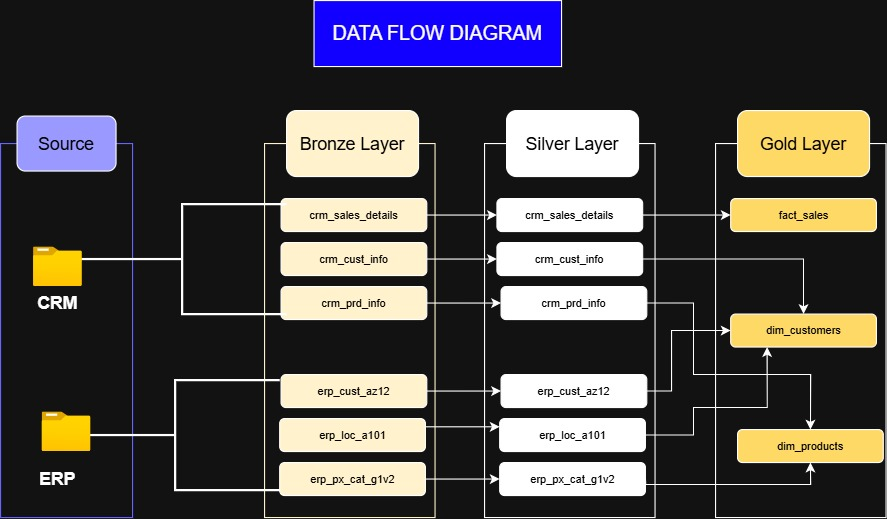
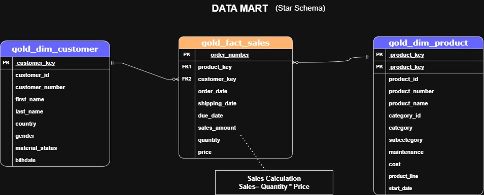
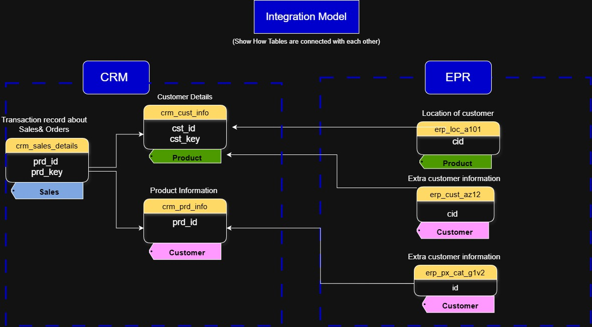
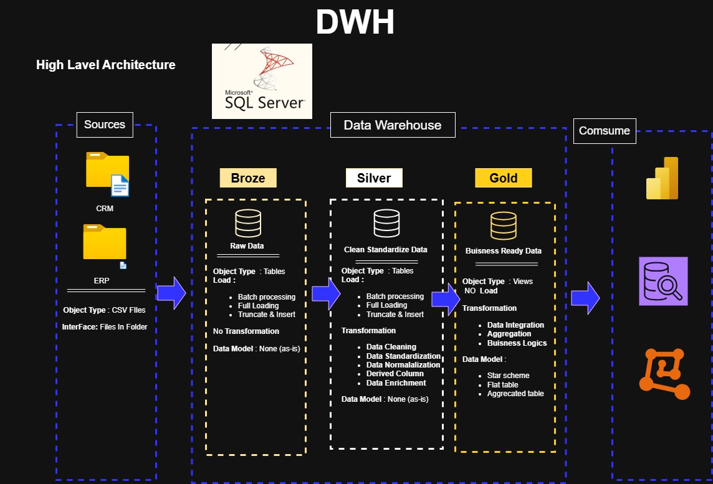

# 🚀SQL Data Warehouse Project 


## 📚 Project Overview

This project demonstrates the design and implementation of a modern SQL Data Warehouse using SQL Server. It follows a layered architecture (Bronze, Silver, and Gold) to transform raw data into clean, reliable, and analytics-ready datasets.

The project covers the complete data warehousing process, including data ingestion, data cleansing, transformation, dimensional modeling, and analytical reporting. It is designed to showcase practical SQL and data engineering skills commonly used in real-world business environments.

## Acknowledgements

 - [DataWithBaraa](https://github.com/DataWithBaraa/sql-data-warehouse-project/blob/92406686380cde6eca208c8b43e6fa40ecd26344/README.md)

## 📂 Repository Structure


```text
sql-data-warehouse-project/
│
├── datasets/                     # Source CSV files
│
├── docs/                         # Project documentation and diagrams
│   ├── Data flow diagram.jpg
│   ├── data_model.jpg
│   ├── High Level Architecture.jpg
│   └── Integration Diagram.jpg
│
├── scripts/
│   ├── bronze/                   # Bronze layer scripts (raw data ingestion)
│   ├── silver/                   # Silver layer scripts (data cleansing & transformation)
│   └── gold/                     # Gold layer scripts (business-ready data models)
│
├── tests/                        # Data quality checks and validation scripts
│
├── LICENSE
└── README.md
```

## Objectives

➡️ Build a scalable SQL Data Warehouse from raw source data.

➡️ Implement ETL (Extract, Transform, Load) processes.

➡️ Clean and standardize data for improved quality.

➡️Design fact and dimension tables using a Star Schema.

➡️Create analytical views to support business reporting.

➡️Apply SQL best practices for maintainability and performance.
## Resources (Tools)
Tools & Resources

● **Datasets**: Access to the project dataset (csv files).

● **SQL Server Express**: Lightweight server for hosting your SQL database.

● **SQL Server Management Studio (SSMS)**: GUI for managing and interacting with databases.

● **Git Repository**: Set up a GitHub account and repository to manage, version, and collaborate on your code efficiently.

● **DrawIO**: Design data architecture, models, flows, and diagrams.

● **Notion**: Get the Project Template from Notion

● **Notion Project Steps**: Access to All Project Phases and Tasks.

## 🏗️ Data Warehouse Architecture

The data architecture for this project follows Medallion Architecture Bronze, Silver, and Gold layers:

![Data Architecture] (docs/High Level Arcitecture.jpg)

● **Bronze Layer** – Stores raw data exactly as received from the source systems.

● **Silver Layer** – Cleans, validates, and transforms the raw data into structured datasets.

● **Gold Layer** – Contains business-ready fact and dimension tables optimized for reporting and analytics.


## 🗝 Key Features

● ETL Pipeline Implementation

● Data Cleaning & Transformation

● Star Schema Design

● Fact & Dimension Tables

● SQL Views for Analytics

● Well-Organized SQL Scripts

● Modular and Maintainable Project Structure

## 📈 Skills Demonstrated
● SQL Development

●T-SQL Programming

● ETL Development

● Data Modeling

● Data Warehousing

● Database Design

● Data Transformation

● Analytical Query Writing
## 📌 Purpose

This project was built as part of my learning journey in Data Engineering and Data Analytics to gain hands-on experience with SQL Data Warehousing concepts and industry best practices.
## License

[MIT](https://choosealicense.com/licenses/mit/)


## Screenshots









